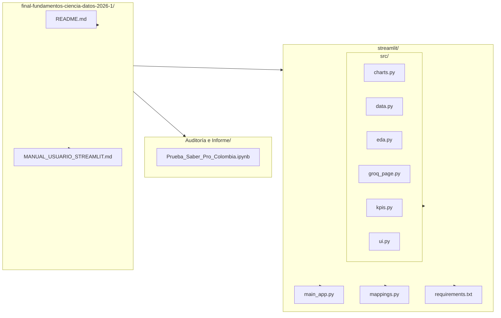

<p align="center">
  
</p>

<h1 align="center">Análisis de Datos de Pruebas Universitarias Saber Pro (2018-2021) Colombia</h1>

## Miembros del equipo

- Miguel Roldan Yepes
- Juan Camilo Cataño Zuleta
- Juan Manuel Agudelo Olarte
- Carlos José Muñoz Cabrera

# Contexto del negocio

Las Pruebas Saber Pro son un insumo central para evaluar la calidad de la educación superior en Colombia. Entender **qué factores socioeconómicos y territoriales se asocian al rendimiento** permite a actores como el Ministerio de Educación, el ICFES y las instituciones de educación superior priorizar recursos, diseñar políticas de equidad (becas, acceso a tecnología, acompañamiento por región) y monitorear si las brechas entre grupos se reducen en el tiempo. Este proyecto aporta evidencia cuantitativa (KPIs de brechas por estrato, acceso a computador, educación de los padres y región) para apoyar esas decisiones, sin atribuir causalidad: el foco es diagnóstico y de priorización.

# Descripción del problema

El ICFES (Instituto Colombiano para la Evaluación de la Calidad de la Educación) realiza anualmente las Pruebas Saber Pro para conocer el desarrollo de las competencias de los estudiantes que están por finalizar sus carreras universitarias.

En este proyecto se usan técnicas de ciencia de datos para analizar los resultados de las Pruebas Saber Pro (2018-2021), tomando como variable de resultado el **rendimiento global** (bajo, medio-bajo, medio-alto, alto) y enriqueciendo los datos con el perfil socioeconómico del ICFES (estrato, acceso a tecnología, educación de los padres, programa, departamento, entre otros). El propósito es encontrar patrones y variables socioeconómicas y territoriales que se relacionen significativamente con el rendimiento académico, cuantificando brechas mediante KPIs definidos (por estrato, acceso a computador, educación materna, región), y así aportar evidencia para el análisis y la toma de decisiones en el ámbito educativo.

## Estructura del repositorio

```
final-fundamentos-ciencia-datos-2026-1/
├── Auditoría/
│   └── Prueba_Saber_Pro_Colombia.ipynb
├── streamlit/
│   ├── main_app.py
│   ├── mappings.py
│   ├── requirements.txt
│   └── src/
│       ├── charts.py
│       ├── data.py
│       ├── eda.py
│       ├── groq_page.py
│       ├── kpis.py
│       └── ui.py
├── MANUAL_USUARIO_STREAMLIT.md
└── README.md
```

<details>
<summary>Ver diagrama Mermaid</summary>


</details>

## Clonación e instalación

1. **Clonar el repositorio**
   ```bash
   git clone https://github.com/Momos20/final-fundamentos-ciencia-datos-2026-1.git
   ```

2. **Crear y activar un entorno virtual** (recomendado)
   ```bash
   python -m venv venv
   source venv/bin/activate   # En Windows: venv\Scripts\activate
   ```

3. **Instalar dependencias**
   Las dependencias de la aplicación Streamlit y del notebook están en `streamlit/requirements.txt`:
   ```bash
   pip install -r streamlit/requirements.txt
   ```

4. **Ejecutar la aplicación Streamlit en local**
   ```bash
   cd streamlit
   streamlit run main_app.py
   ```
   Luego abrir en el navegador la URL que muestre la terminal (por defecto `http://localhost:8501`). Para usar el dashboard se debe subir el archivo **saber_pro.csv** desde el menú lateral (ver [Set de datos](#set-de-datos) para obtenerlo).

**Nota:** Para trabajar solo con el notebook de auditoría e informe (`Auditoría e Informe/Prueba_Saber_Pro_Colombia.ipynb`), se puede usar el mismo entorno; las librerías necesarias están incluidas en `streamlit/requirements.txt`.

## Set de datos

El proyecto utiliza el dataset **Saber Pro (2018-2021)** de Colombia. Contiene registros de estudiantes que presentaron la prueba al finalizar (o próximo a finalizar) su carrera universitaria, con información de rendimiento y de perfil socioeconómico y territorial proporcionada por el ICFES.

**Dónde obtenerlo**
- **Google Drive:** [Saber Pro — descarga directa](https://drive.google.com/file/d/11I74e9DOLzR0_7XOV5Hr4ZaEsvjIbWR1/view?usp=sharing).
- **Kaggle (competencia origen):** [UDEA/ai4eng 20252 - Pruebas Saber Pro Colombia](https://kaggle.com/competitions/udea-ai-4-eng-20252-pruebas-saber-pro-colombia) — mismo dataset, útil si trabajas desde Kaggle o Notebooks.

Para que el dashboard Streamlit reconozca el archivo, debe llamarse **saber_pro.csv** (el nombre se valida al subirlo en la app).

**Contenido del dataset (resumen)**  

| Tipo | Ejemplos de variables |
|------|------------------------|
| **Identificación y contexto** | `ID`, `PERIODO_ACADEMICO` |
| **Programa y territorio** | `E_PRGM_ACADEMICO`, `E_PRGM_DEPARTAMENTO` |
| **Socioeconómicas** | `F_ESTRATOVIVIENDA`, `E_VALORMATRICULAUNIVERSIDAD`, `E_HORASSEMANATRABAJA`, `F_TIENEINTERNET`, `F_TIENECOMPUTADOR`, `F_EDUCACIONPADRE`, `F_EDUCACIONMADRE`, `F_TIENELAVADORA`, `F_TIENEAUTOMOVIL`, entre otras |
| **Resultado (target)** | `RENDIMIENTO_GLOBAL` (bajo, medio-bajo, medio-alto, alto) |
| **Indicadores de la prueba** | `INDICADOR_1`, `INDICADOR_2`, `INDICADOR_3`, `INDICADOR_4` (métricas numéricas por competencia) |

Con estas variables se analizan patrones y brechas entre grupos (estrato, acceso a tecnología, educación de los padres, región) en relación con el rendimiento académico.

## Streamlit

La aplicación web del proyecto permite explorar el dataset Saber Pro de forma interactiva: resumen y auditoría de datos, trazabilidad del procesamiento, KPIs de brechas (estrato, tecnología, educación materna, región), EDA con tablas y gráficos, y una página de consultas asistidas por IA (Groq).

- **Acceso en línea:** [Saber Pro — Streamlit](https://final-fundamentos-ciencia-datos.streamlit.app/)
- **Ejecución en local:** ver pasos 3 y 4 en [Clonación e instalación](#clonación-e-instalación). Es necesario tener el archivo **saber_pro.csv** para cargarlo desde el menú lateral de la app.

**Manual de usuario:** para una guía detallada de uso (carga del archivo, menú, páginas Resumen / Procesamiento / KPI / EDA / Groq IA y posibles problemas), consultar el [Manual de usuario — Dashboard Streamlit](MANUAL_USUARIO_STREAMLIT.md). 

## Créditos

Dataset: **RLX. UDEA/ai4eng 20252 - Pruebas Saber Pro Colombia.** [Kaggle](https://kaggle.com/competitions/udea-ai-4-eng-20252-pruebas-saber-pro-colombia), 2025.
